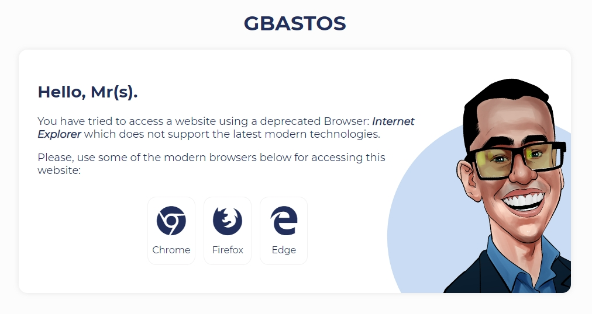

# Splash Page Preview

<p align="center">
  <a href="https://guilhermeborgesbastos.github.io/ie-splash-page/" taget="blank">
    
  </a>
</p>

# Internet Explorer - Deprecated Warning Page

Depending on the requirements, web browsers that do not fully support ES6 features may be out of the scope of some projects. For those cases, it's always good to have a friendly message for users coming from browsers like MSIE (Internet Explorer).

This repository contains a simple `Splash page` that can be used to give a friendly message for users using deprecated browsers.

It's possible to configure `Nginx`or `Apache` to redirect users coming from specific browser vendors to specific URLs or alternative `root path`, see the example below:
```
# Redirect agents from Internet Explorer to another URL.
location / {
    if ($http_user_agent ~* '(MSIE|rv:11)') {
        return 301 https://$host$request_uri; # Update URL here...
    }
}
```

# Downsides of supporting deprecated browsers

As a developer, we should bend to the wishes of our customers, based on their business plans and strategies. In this case, offer support for deprecated browsers will be necessary.

It is your job to also inform your client/customer that the decision to support Internet Explorer is a very short-sighted one:

- You are punishing all other customers. Javascript would need to be compiled to ES5 instead of ES 6 which increases the bundle size in some cases by 30%. So a significant performance decrease for 97% of users;
- Your development time increased by 30%. The time that could be spent on new features/quality improvement;
- Maintenance time increases. As code gets ‘hacked’ for IE. Then the next developer sees that mess and tries to figure out what is going on;
- Overall the Development time is about 10–30% higher for supporting IE 11;

There are ways of handling it with `polyfills`, `babel`, and other `hacks` but there is a cost related to each decision.